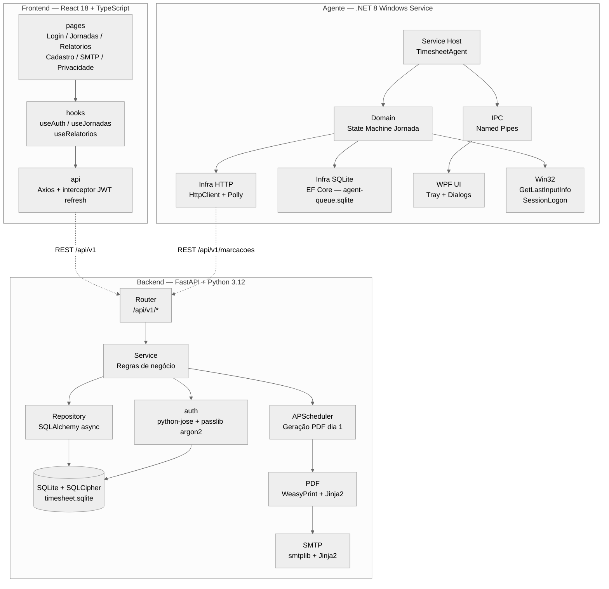

## Arquitetura Interna

Organização em módulos e camadas do código-fonte.

---

```mermaid
%%{init: {'theme': 'neutral'} }%%
flowchart TD
  subgraph Frontend["Frontend — React 18 + TypeScript"]
    Pages["pages\nLogin / Jornadas / Relatorios\nCadastro / SMTP / Privacidade"] --> Hooks["hooks\nuseAuth / useJornadas\nuseRelatorios"]
    Hooks --> APIClient["api\nAxios + interceptor JWT refresh"]
  end

  subgraph Backend["Backend — FastAPI + Python 3.12"]
    Router["Router\n/api/v1/*"] --> Service["Service\nRegras de negócio"]
    Service --> Repository["Repository\nSQLAlchemy async"]
    Repository --> MainDB[("SQLite + SQLCipher\ntimesheet.sqlite")]
    Service --> Scheduler["APScheduler\nGeração PDF dia 1"]
    Scheduler --> PDFGen["PDF\nWeasyPrint + Jinja2"]
    PDFGen --> SMTP["SMTP\nsmtplib + Jinja2"]
    Service --> Auth["auth\npython-jose + passlib argon2"]
    Auth --> MainDB
  end

  subgraph Agent["Agente — .NET 8 Windows Service"]
    ServiceHost["Service Host\nTimesheetAgent"] --> Domain["Domain\nState Machine Jornada"]
    Domain --> InfraHTTP["Infra HTTP\nHttpClient + Polly"]
    Domain --> InfraDB["Infra SQLite\nEF Core — agent-queue.sqlite"]
    ServiceHost --> IPC["IPC\nNamed Pipes"]
    IPC --> WPF["WPF UI\nTray + Dialogs"]
    Domain --> Win32["Win32\nGetLastInputInfo\nSessionLogon"]
  end

  APIClient -..->|"REST /api/v1"| Router
  InfraHTTP -..->|"REST /api/v1/marcacoes"| Router
```

---

_Criado em: 2026-06-01 00:00_
