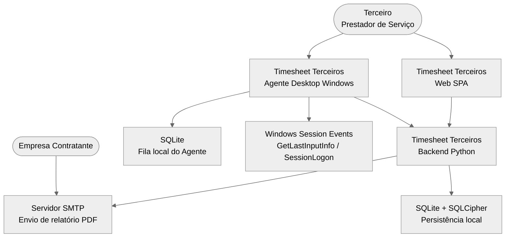

## Contexto

Visão externa: atores, integrações e dependências.

---

```mermaid
%%{init: {'theme': 'neutral'} }%%
flowchart TD
  U([Terceiro\nPrestador de Serviço]) --> WEB[Timesheet Terceiros\nWeb SPA]
  U --> AGT[Timesheet Terceiros\nAgente Desktop Windows]
  WEB --> BACKEND[Timesheet Terceiros\nBackend Python]
  AGT --> BACKEND
  BACKEND --> SMTP["Servidor SMTP\nEnvio de relatório PDF"]
  BACKEND --> DB["SQLite + SQLCipher\nPersistência local"]
  AGT --> AGDB["SQLite\nFila local do Agente"]
  AGT --> WIN32["Windows Session Events\nGetLastInputInfo / SessionLogon"]
  CONTRATANTE([Empresa Contratante]) --> SMTP
```

---

_Criado em: 2026-06-01 00:00_
