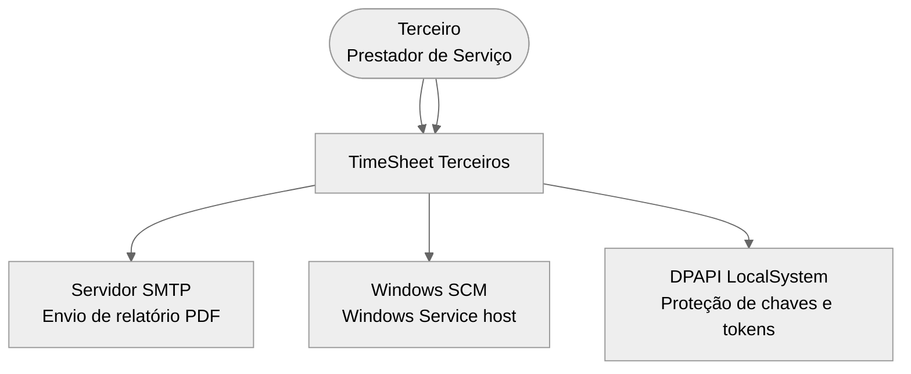

## Contexto

Visão externa: atores, integrações e dependências.

---

```mermaid
%%{init: {'theme': 'neutral'} }%%
flowchart TD
  Terceiro([Terceiro\nPrestador de Serviço]) --> Sistema
  Sistema[TimeSheet Terceiros]
  Sistema --> SMTP["Servidor SMTP\nEnvio de relatório PDF"]
  Sistema --> WinSCM["Windows SCM\nWindows Service host"]
  Sistema --> DPAPI["DPAPI LocalSystem\nProteção de chaves e tokens"]
  Terceiro --> Sistema
```

---

_Criado em: 2026-06-02 18:40:00_
