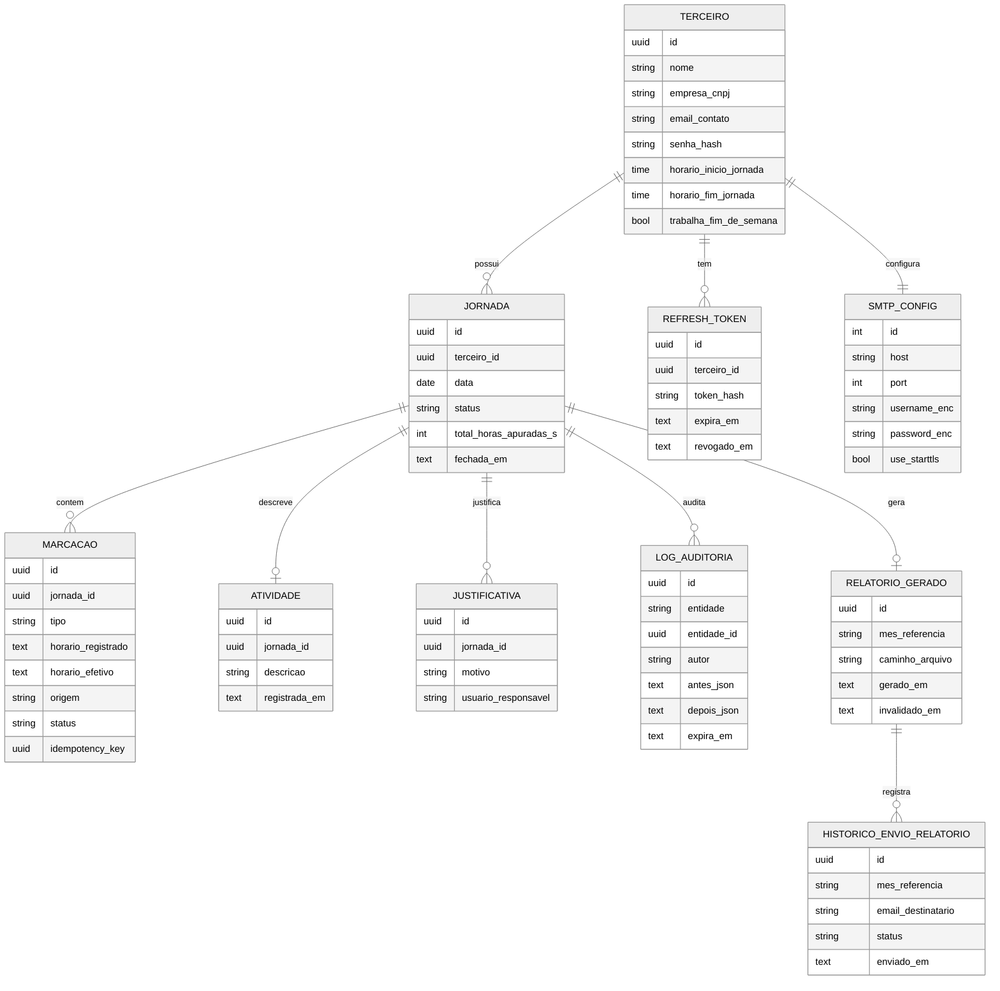

## Modelo de Dados

Entidades, campos-chave e relações.

---

```mermaid
%%{init: {'theme': 'neutral'} }%%
erDiagram
  TERCEIRO ||--o{ JORNADA : possui
  TERCEIRO ||--o{ REFRESH_TOKEN : tem
  TERCEIRO ||--|| SMTP_CONFIG : configura
  JORNADA ||--o{ MARCACAO : contem
  JORNADA ||--o| ATIVIDADE : descreve
  JORNADA ||--o{ JUSTIFICATIVA : justifica
  JORNADA ||--o{ LOG_AUDITORIA : audita
  JORNADA ||--o| RELATORIO_GERADO : gera
  RELATORIO_GERADO ||--o{ HISTORICO_ENVIO_RELATORIO : registra

  TERCEIRO {
    uuid id
    string nome
    string empresa_cnpj
    string email_contato
    string senha_hash
    time horario_inicio_jornada
    time horario_fim_jornada
    bool trabalha_fim_de_semana
  }

  JORNADA {
    uuid id
    uuid terceiro_id
    date data
    string status
    int total_horas_apuradas_s
    text fechada_em
  }

  MARCACAO {
    uuid id
    uuid jornada_id
    string tipo
    text horario_registrado
    text horario_efetivo
    string origem
    string status
    uuid idempotency_key
  }

  ATIVIDADE {
    uuid id
    uuid jornada_id
    string descricao
    text registrada_em
  }

  JUSTIFICATIVA {
    uuid id
    uuid jornada_id
    string motivo
    string usuario_responsavel
  }

  LOG_AUDITORIA {
    uuid id
    string entidade
    uuid entidade_id
    string autor
    text antes_json
    text depois_json
    text expira_em
  }

  REFRESH_TOKEN {
    uuid id
    uuid terceiro_id
    string token_hash
    text expira_em
    text revogado_em
  }

  RELATORIO_GERADO {
    uuid id
    string mes_referencia
    string caminho_arquivo
    text gerado_em
    text invalidado_em
  }

  HISTORICO_ENVIO_RELATORIO {
    uuid id
    string mes_referencia
    string email_destinatario
    string status
    text enviado_em
  }

  SMTP_CONFIG {
    int id
    string host
    int port
    string username_enc
    string password_enc
    bool use_starttls
  }
```

---

_Criado em: 2026-06-01 00:00_
