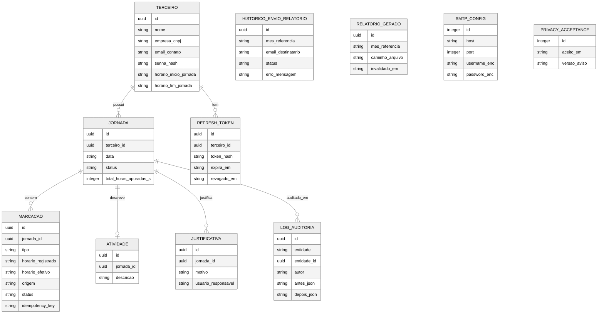

## Modelo de Dados

Entidades, campos-chave e relações.

---

```mermaid
%%{init: {'theme': 'neutral'} }%%
erDiagram
  TERCEIRO ||--o{ JORNADA : possui
  TERCEIRO ||--o{ REFRESH_TOKEN : tem
  JORNADA ||--o{ MARCACAO : contem
  JORNADA ||--o| ATIVIDADE : descreve
  JORNADA ||--o{ JUSTIFICATIVA : justifica
  JORNADA ||--o{ LOG_AUDITORIA : auditado_em
  TERCEIRO {
    uuid id
    string nome
    string empresa_cnpj
    string email_contato
    string senha_hash
    string horario_inicio_jornada
    string horario_fim_jornada
  }
  JORNADA {
    uuid id
    uuid terceiro_id
    string data
    string status
    integer total_horas_apuradas_s
  }
  MARCACAO {
    uuid id
    uuid jornada_id
    string tipo
    string horario_registrado
    string horario_efetivo
    string origem
    string status
    string idempotency_key
  }
  ATIVIDADE {
    uuid id
    uuid jornada_id
    string descricao
  }
  JUSTIFICATIVA {
    uuid id
    uuid jornada_id
    string motivo
    string usuario_responsavel
  }
  LOG_AUDITORIA {
    uuid id
    string entidade
    uuid entidade_id
    string autor
    string antes_json
    string depois_json
  }
  REFRESH_TOKEN {
    uuid id
    uuid terceiro_id
    string token_hash
    string expira_em
    string revogado_em
  }
  HISTORICO_ENVIO_RELATORIO {
    uuid id
    string mes_referencia
    string email_destinatario
    string status
    string erro_mensagem
  }
  RELATORIO_GERADO {
    uuid id
    string mes_referencia
    string caminho_arquivo
    string invalidado_em
  }
  SMTP_CONFIG {
    integer id
    string host
    integer port
    string username_enc
    string password_enc
  }
  PRIVACY_ACCEPTANCE {
    integer id
    string aceito_em
    string versao_aviso
  }
```

---

_Criado em: 2026-06-02 18:40:00_
