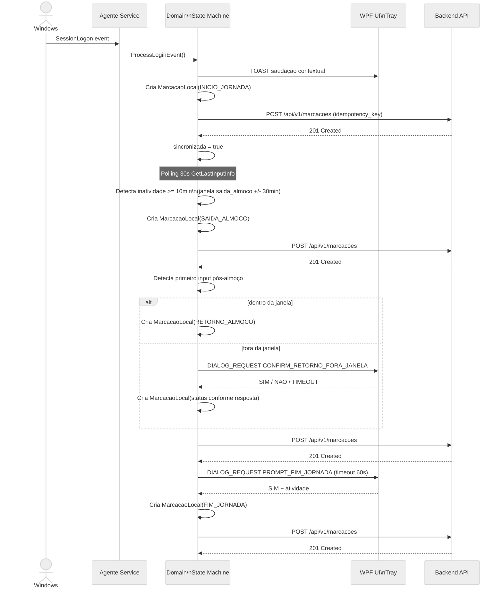
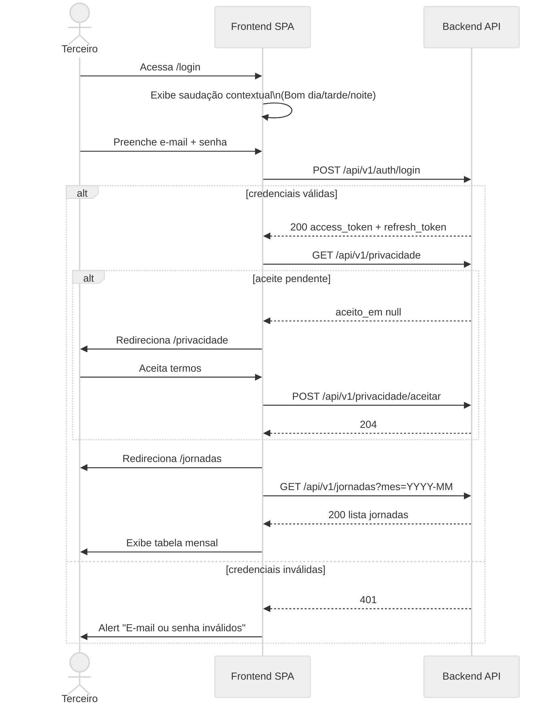
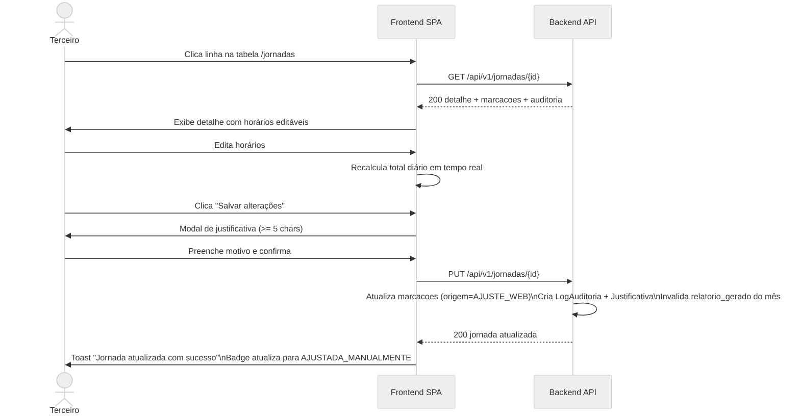
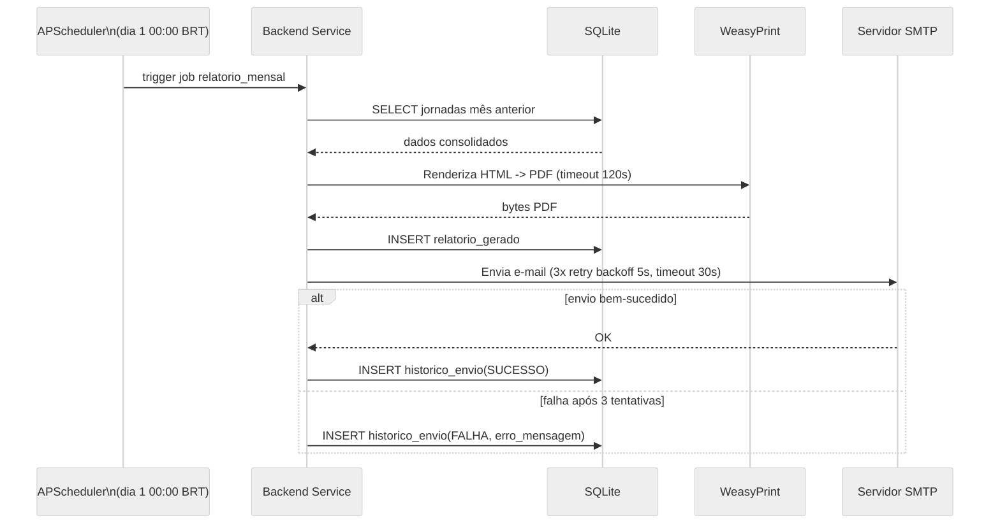

## Fluxos de Usuário

Sequência de interações para os principais fluxos da aplicação.

---

### Registro Automático de Marcação (Agente)

### Login Web e Acesso ao Dashboard

### Ajuste Manual de Jornada (Web)

### Geração e Envio de Relatório Mensal

---

_Criado em: 2026-06-01 00:00_
