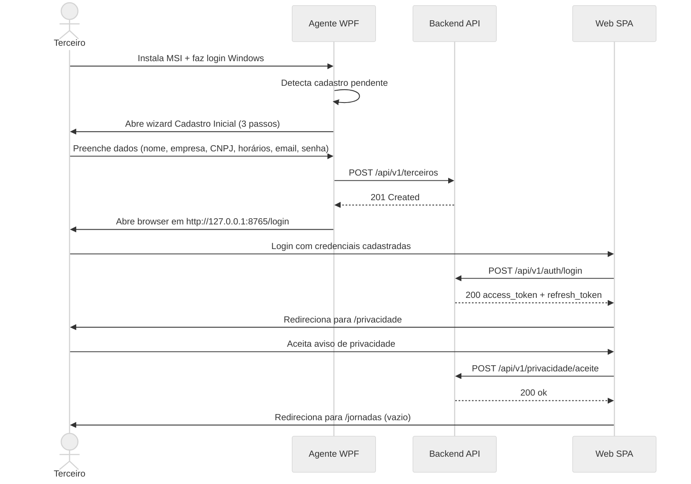
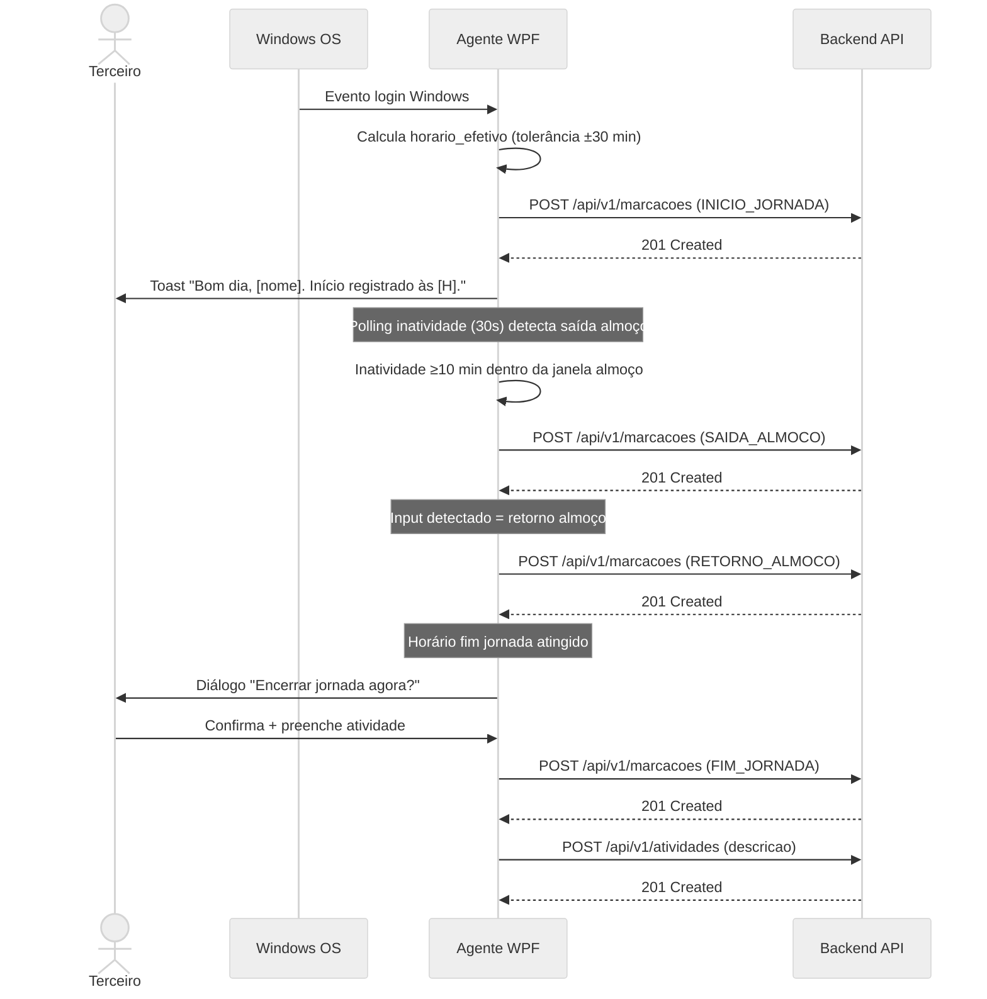
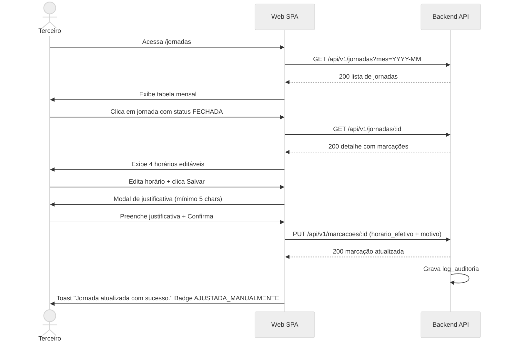
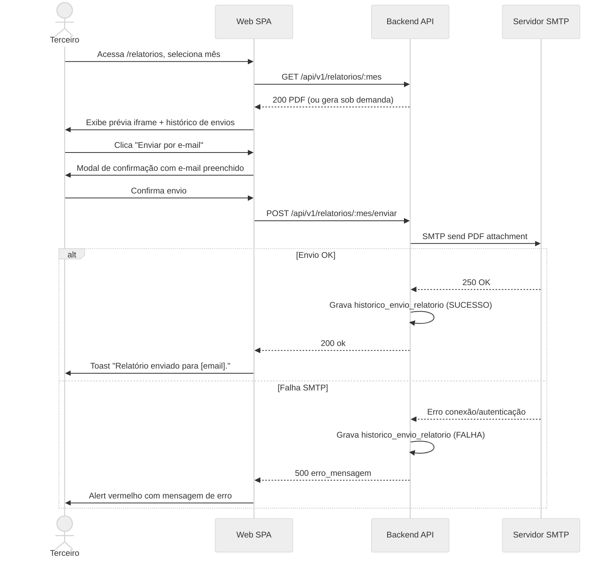

## Fluxos de Usuário

Sequência de interações para os principais fluxos da aplicação.

---

### Onboarding

### Dia Normal (marcações automáticas)

### Ajuste Manual de Jornada (Web)

### Envio de Relatório Mensal

---

_Criado em: 2026-06-02 18:40:00_
